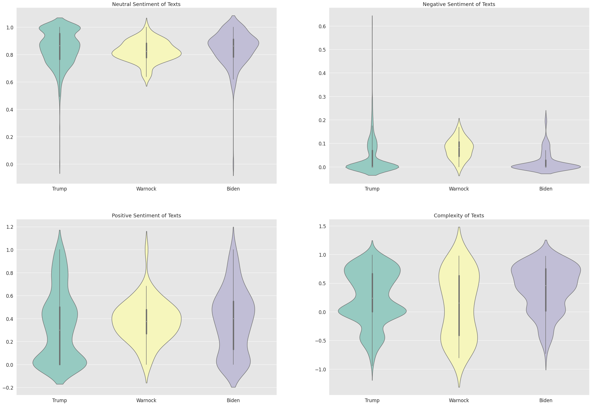
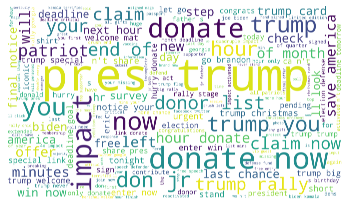
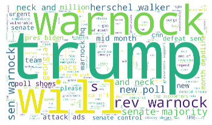

# Political SMS Dashboard 

## Preview 

Since around the 2020 election I've been getting regular text messages from both the Biden and Trump campaign via text messages. In preparation for the midterm elections in 2022 I decided to work at mining these text messages as data to gain better insight into how these medium in used in partisan campaigns and try to decipher how these campaigns view their base. The dataset currently spans January 2021 to the current date of me writing this November 2021 and contains all of the text messages sent to me from 88022 which is the Trump campaign, 52005 the Warnock campaign, and 43367 the Biden campaign. My ultimate vision for this project is to gather text messages from as many campaigns as possible and display both the text and visualizations in a web based dashboard. But for now this is a preview of the data as it stands today. 

I currently have over 800 texts, the trump campaign by far is has the most recorded text messages with 619 text messages, 181 come from the Biden campaign, and Richard Warnock's campaign sent 55 message. While I got signed up for these campaigns at different times, I never unsubscribed from any of the sms campaigns. 

I utilized sentiment analysis to measure the text messages' mood so to speak. This is done with software that looks at a piece of text and matches the words with a preset list of words and punctuation to create a numerical score for a given sentiment. The sentiment analyzer I use tracks positive and negative sentiment along with a measure called compound and neutrality. Compound essentially refers to the complexity of a piece of text, and I'll use complexity in it's place for this project. While neutrality in this case refers to an lack of emotion in a body of text. As an example an instruction manual for a printer will likely score high in both compound and neutrality, while a mean tweet would be low in compound and high in negative sentiment. You can read more about how this works [here](https://github.com/cjhutto/vaderSentiment). 

### Sentiment and Text Length Over Time 

When grouped by months the Trump campaign starts out quite low in the positive sentiment but steadily rises into the Fall of 2020. It then dips down which corresponds to a significant rise in negative sentiment in the winter/spring of 2021, the total number of words from his campaign drastically rose around that time too. Leading up to the coup attempt of Jan 6th, his text campaign was quite active but only briefly paused after the events. During this time frame as well the complexity of his texts went up considerably, which usually does correlate with longer text messages. Biden's campaign frequently tends to be the inverse of the Trump campaign's text messages, though they tend to come less frequently and are longer and more complex. Warnock's campaign is a more extreme version of Biden's texts in that they are much longer and changed more drastically in tone. Warnock's campaign also tends to mix positive and negative sentiments more readily than Biden or Trump's campaigns. 

The above chart is a violin plot which is similar to a box plot in that it shows the distribution of the sentiment scores broken down by campaign. Both neutral and negative sentiments are heavily skewed. For neutral sentiments, most texts sent by each campaign use a lot of neutral language, with a notable few being highly non-neutral for the Biden and Trump campaign. Most texts shy away from negative language but the Trump campaign in particular has a long tail reach out towards highly negative sentiments. While not dramatic, the Biden campaign uses more complex language out of the three, while Warnock's campaign is the most consistent in terms of the positive language used though considering that it's the smallest portion of the data that could just be a sampling bias. 

Also more for fun, I generated word clouds of the most frequently used nouns in each of the text message campaigns. 

#### Trump 

#### Biden 

#### Warnock 

While word clouds aren't exactly professional or academic charts, I do think these offer some quick insight into the minds of these campaigns. What I do find particularly interesting is the other people that pop up as frequently used nouns. The Trump campaign frequently brings up Donald Trump Jr. who did play a rather large role in his father's campaign, while Joe Biden's campaign made frequent reference to Kamala Harris his vice president, also quite a few of the messages were signed off by Jaime who idenifies themselves as the one actually sending out the messages (it would be bizarre to imagine any of the actual candidates doing the texting themselves). Warnock's mentioned Trump even more frequently than Warnock himself. 

I'll be posting more information about this project as it continues to unfold. I plan on doing some more intricate text mining after I get the basic web view set up. If you're interested in looking at the data yourself you can find a link to the csv file containing all of the text messages here: 

## Technical notes: 
how to grab text messages from iphone: https://superuser.com/questions/237339/how-to-get-text-messages-off-of-iphone-in-ubuntu

file location within iphone backup: https://osxdaily.com/2010/07/08/read-iphone-sms-backup/

tutorial for TextBlob: https://rwet.decontextualize.com/book/textblob/

